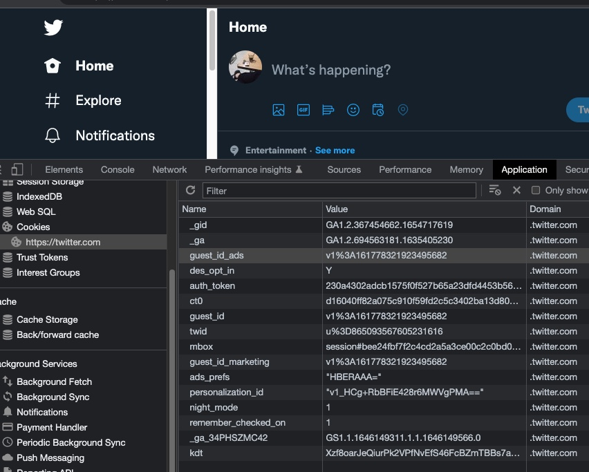

# Cookie 

## a. Defenisi 

Cookie adalah data teks yang disimpan pada komputer user oleh suatu website.
Penyimpanan data ini umumnya melalui media browser. Adapun karakteristik cookies
adalah sebagai berikut:

-  Cookie ini disimpan khusus oleh masing-masing browser, artinya masing-masing browser memiliki data cookie tersendiri.
- Data cookie hanya merujuk ke website tertentu, sehingga ketika browser mengirim data cookie ke webserver, hanya data cookie website tersebut yang akan dikirim.
- Ketika merequest alamat website tertentu melalui browser, maka browser juga akan
mengirim data cookie yang ada di komputer ke website tersebut.
- Data cookie yang disimpan umumnya maksimal 4096 byte atau 4Kb dan maksimal
180 cookie per domain (chrome), sehingga kita tidak bisa menyimpan data dalam
jumlah besar pada cookie.
Masing masing browser menyimpan cookie di tempat yang berbeda

---
Pada browser, kita dapat melihat data cookie melalui Web Developer Tools. Karena data
cookie ini disimpan per website. Maka untuk melihatnya kita harus membuka website
tersebut.
Contoh: pada browser chrome, untuk melihat data cookies, buka Developer Tools (F12)
kemudian pilih tab Application, selanjutnya pilih bagian cookies

 

## b. Cara kerja Cookie 
Pada saat kita meload halaman website atau melakukan pengaturan tertentu (misal
pengaturan bahasa atau timezone), website tersebut akan memerintahkan browser untuk
menyimpan data tertentu ke dalam file cookies.
Selanjutnya, ketika kita meload kembali website tersebut, maka data cookie tersebut juga
akan terkirim bersama dengan pengiriman HTTP Header. Data cookie ini akan digunakan
website untuk berbagai keperluan, salah satunya melakukan pengaturan bahasa atau
timezone sehingga content yang dikirim sesuai dengan preferensi user.

 

## c. Manfaat menggunakan Cookie 

1. Fitur “Remember me” pada login. Fitur ini mengijinkan user yang sudah login pada
suatu website ( tidak logout) untuk tidak perlu login kembali maka ketika user tersebut
mengakses lagi ke website tersebut.
2. Fitur shopping chart. fitur ini dapat dicoba peda web e-commerce. Buka salah satu
e-commerce dan masukkan beberapa item ke dalam keranjang. Selanjutnya kita dapat
mengakses kembali item-item tersebut di dalam keranjang meski kita sudah menutup
website atau browser kita.
3. Google Account. Google akan merekam account yang kita gunakan, sehingga akan
memudahkan kita untuk berpindah dari account satu ke account yang lain.
4. Iklan. Dengan menggunakan cookie, webserver dapat menampilkan iklan sesuai
dengan preferensi produk apa saja yang kita sukai.
5. Pemilihan bahasa, tema warna, font dan lain sebagainya pada sebuah website

## d. Membuat Cookies Pada PHP
Untuk membuat cookies pada PHP, gunakan fungsi setcookie(). Fungsi ini memiliki
enam argumen, yaitu:
1. Nama cookie, berisi nama variabel cookie.
2. Nilai cookie, data yang akan disimpan yang merujuk pada nama cookie (nomor 1)
3. Expire. Kapan cookie akan berakhir. Format waktu berupa Unix timestamp, yang
dibuat dengan menggunakan fungsi time(). Jika nilai expire dikosongkan atau bernilai
0, maka data cookie akan expire/dihapus ketika browser ditutup (ketika session
berakhir)
4. Path. Path/Lokasi pada server di mana cookie dapat digunakan. Jika diisi tanda slash
‘/’, maka cookie dapat digunakan diseluruh bagian website. Jika diisi nilai tertentu,
misal ‘/blog/’, maka cookie hanya dapat digunakan pada direktori blog dan
subdirektorinya, misal: ‘/blog/archive/’.
Jika nilai dikosongkan, maka lokasi akan merujuk ke direktori dimana cookie di buat.
5. Domain. subdomain dimana cookie dapat digunakan.
Misal: jika kita isi (unimerz.ac.id), maka cookie akan dapat digunakan pada semua
subdomain seperti: fikom.unimerz.ac.id, ft.unimerz.ac.id, dll.
Jika nilainya kosong, maka cookie akan berlaku pada seluruh bagian domain namun
tidak pada subdomainnya.
6. Secure. Default false. Jika true, browser akan mengirim cookie ke websever hanya
jika koneksi berbentuk HTTPS.
7. Httponly. Default false. Cookie hanya dapat diakses hanya melalui protokol http.
Kita tidak bisa mengosongkan waktu expire, dengan demikian, kita tidak bisa membuat
cookie dengan umur yang tidak terbatas, solusinya, kita buat waktu expired cookie sangat
lama, misal 5 tahun kedepan

<pre>Note: Dari ketujuh argumen tersebut, yang paling sering digunakan adalah empat pertama. Khusus untuk argumen domain, isinya (jika ada) harus menggunakan dot (.) </pre>

### Menghitung Waktu Expired

Pada argumen ke tiga, kita menentukan kapan cookie akan berakhir (expired), karena
nilai yang diisikan berupa timestamp, maka cara yang paling mudah untuk menentukan
waktu expire adalah menggunakan hitungan mundur dari detik, menit, jam, hari, dst…

Contoh untuk membuat waktu expire cookie 30 hari kedepan, maka kita isikan 
<code> time() (60 * 60 * 24 * 30)  </code> yang artinya:
- time() yang berarti waktu ketika script dieksekusi (dalam unix timestamp).
- 60 pertama yang berarti 60 detik (1 menit = 60 detik);
- 60 kedua yang berarti 60 menit (1 jam = 60 detik)
- 24 yang berarti 24 jam (1 hari = 24 jam)
- 30 yang berarti 30 hari

Cara lain yang lebih mudah adalah dengan menggunakan format tanggal relatif
(Relative Date Format) yaitu dengan menggunakan kata-kata day, month, weeks, year,
dsb.

Contoh penggunaan relative date format pada cookie:

<code>
<pre>
// Expire 7 hari kedepan
setcookie('background-color', '#75b14a', strtotime('+7
days'), '/');

// Expire 3 bulan kedepan
setcookie('background-color', '#75b14a', strtotime('+3
months'), '/');

// Expire 1 tahun kedepan
setcookie('background-color', '#75b14a', strtotime('+1
year'), '/');
</pre>

</code>

<pre>Note: kita dapat menggunakan bentuk tunggal maupun bentuk jamak (dengan
tambahan s). Misal: penggunaan day atau days akan menghasilkan nilai yang sama.</pre>

## e. Membaca Cookie pada PHP 

Untuk membaca data cookie, kita gunakan variabel bawaan PHP <code>$_COOKIE</code>, jika tidak ada
cookie sama sekali maka variabel ini tetap ada namun bernilai kosong. Untuk mengambil
data cookie tertentu, gunakan variabel <code>$_COOKIE</code> dengan index nama cookie tersebut,
misal: untuk nama cookie theme, kita panggil menggunakan <code>$_COOKIE['theme']</code>
Untuk menampilkan semua data cookie, kita gunakan fungsi <code>print_r()</code>, contoh: <code>print_r($_COOKIE)</code>

<code>
<pre>print_r($_COOKIE);
/* Hasil:
Array
(
 [PHPSESSID] => vprkeu3jsk7qmkohbhcu0fcto7
 [settings] => Array
 (
 [background-color] => #4e79a0
 [font-size] => 15px
 )
)*/
</pre>
</code>

## f. Menghapus Cookie 

Untuk menghapus cookie pada PHP, kita cukup mengisi nilai waktu pada masa sebelum
saat ini. Misal kita ingin hapus data cookie ”user”:
<code>
<pre>
setcookie("user", "", time() - 3600);
</pre>
</code>
Pada contoh di atas, kita mengisi variabel cookie “user” dengan waktu satu jam (3600
detik) sebelum saat perintah setcookie() tersebut dijalankan. Karena karakteristik cookie
hanya dapat bekerja dengan menghitung masa waktu yang tersisa, sehingga jika diisi nilai
minus variabel cookie akan terhapus secara otomatis.
