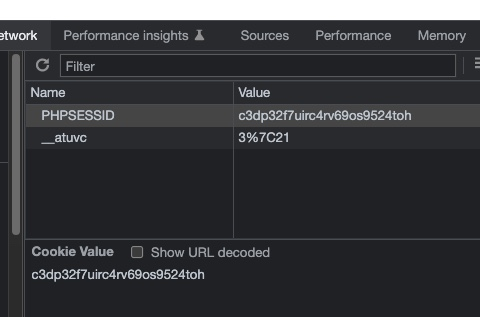

# Session & Cookies
## a. Defenisi 

Dalam PHP, session merupakan data yang disimpan dalam suatu server yang dapat
digunakan secara global di server tersebut, dimana data tersebut spesifik merujuk ke
user/client tertentu. Contoh penggunaan session adalah ketika user telah login di halaman
tertentu, maka ketika membuka halaman lain, PHP akan mengingat bahwa user tersebut
telah login.

Contoh lain ketika kita telah login pada Google, maka setiap kali kita membuka layanan
Google seperti GMail, Google Drive, dll di tab berbeda, kita akan selalu dalam keadaan
login, kecuali kita buka dengan browser yang berbeda. 

## b. Cara Kerja 
<code> session_start() </code> 

 dengan kode diatas maka session telah dapat digunakan 

 

## c. Sisi Server 

Dari sisi server, PHP akan membuat file yang disebut file session yang diawali dengan
sess_ dan diikuti dengan ID session, dimana ID Session tersebut mereferensikan id
session yang ada di browser client.

File Session secara default disimpan di dalam direktori temporary dimana letak direktory
ini tergantung dari masing-masing sistem operasi yang digunakan. untuk mengetahui
dimana php menyimpan file session, dapat menggunakan perintah: 
<code> session_save_path() </code>

 

## d. Sisi Client / User 
Selanjutnya dari sisi client/user, karakteristik session PHP:
 - Jika browser mengijinkan penggunaan cookie, maka browser akan membuat file cookie
dengan nama default yaitu PHPSESSID dengan nilai (value) ID session. Lokasi
penyimpanan file tersebut berbeda beda tergantung jenis browser yang digunakan,
untuk google chrome lokasi cookie berada di: C:\Users\<NAMA
USER>\AppData\Local\Google\Chrome\User Data\Default dengan nama file
Cookie, 

 

## e. <code> Session.php </code>

<code>

<pre>
echo session_save_path();

session_start();
$_SESSION['user'] = 'fikom_unimerz';
$_SESSION['isLogin'] = 1;
</pre>
</code>

Untuk mengawali menjalankan session, kita gunakan perintah session_start() yang
akan memberitahu server bahwa kita akan menggunakan session, selanjutnya server akan
mengecek apakah pengunjung telah memiliki session ID:
1. jika ya, maka server akan mengambil data sesuai dengan ID session yang di minta oleh
browser (misal di file a.php kita telah menjalankan perintah session_start()
kemudian di file b.php kita jalankan lagi perintah session_start(), maka ketika
menjalankan file b.php browser akan mengirimkan ID Session, sehingga data session
yang terbentuk ketika menjalankan file a.php akan dipakai lagi ketika kita menjalankan
file b.php),
2. jika tidak, maka server akan membuat file session dengan nama sess_ID dan
mengirimkan id tersebut ke browser untuk dibuatkan cookie.

## d. <code> Destroy Session</code>

Untuk mengakhiri session pada PHP, kita gunakan perintah 

<code>
<pre>
session_destroy()
</pre>
</code>

dengan
perintah ini maka file session akan dihapus dari server. contohnya ketika user logout, maka
session akan berakhir dan user diminta untuk login kembali.

<code>

</pre>